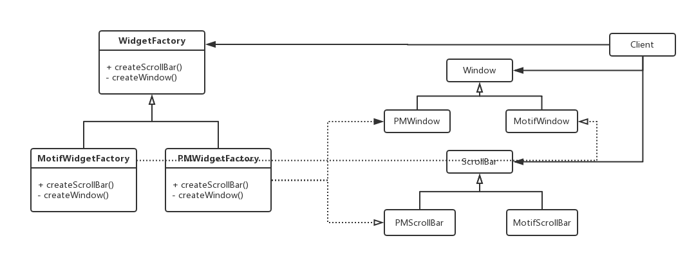
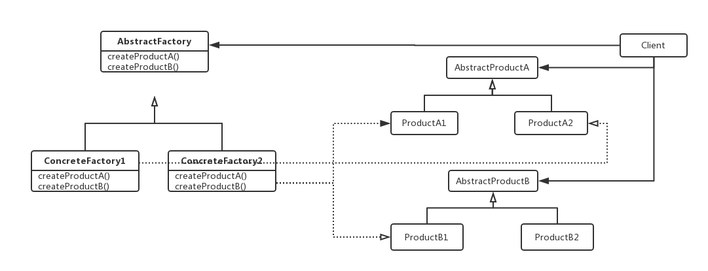

### Abstract Factory

抽象工厂模式——对象创建型模式。

#### 1、目的

提供一个创建一系列相关或相互依赖对象的接口，而无需指定它们具体的类。

#### 2、动机

考虑一个支持多种视感标准的用户界面工具包，如Motif和Presentation Manager。不同的视感风格为诸如滚动条、窗口和按钮等用户界面“窗口组件”定义不同的外观和行为。为保证视感风格标准间的可移植型，一个应用不应该为一个特定的视感外观硬编码它的窗口组件。在整个应用中实例化特定视感风格的窗口组件类将使得以后很难改变视感风格。

为解决这一问题，我们可以定义一个WidgetFactory类，这个类声明了一个用来创建每一个基本窗口组件的接口。每一个窗口组件都有一个抽象类，而具体子类则实现了窗口组件的特定视感风格。对于每一个抽象窗口组件类，WidgetFactory接口都有一个返回新窗口组件对象的操作。客户调用这些操作以获得窗口组件实例，但客户并不知道他们正在使用的是哪些具体类，这样客户就不依赖于一般的视感风格，如下图所示：

每一个视感标准都对应一个具体的WidgetFactory子类。每一个子类实现那些用于创建合适视感风格的窗口组件的操作。即客户仅与抽象类定义的接口交互，而不使用特定的具体类的接口。

WidgetFactory也增强了具体窗口组件类之间依赖关系。

#### 3、适用性

在以下情况可以使用Abstract Factory模式：

- 一个系统要独立于它的产品的创建、组合和表示时；
- 一个系统要由多个产品系列中的一个来配置时；
- 当要强调一系列相关的产品对象的设计以便进行联合使用时；
- 当提供一个产品类库，而只想显示它们的接口而不是实现时。

#### 4、结构图

#### 5、参与者

- AbstractFactory：声明一个创建抽象产品对象的操作接口；
- ConcreteFactory：实现创建具体产品对象的操作；
- AbstractProduct：为一类产品对象声明一个接口；
- ConcreteProduct：定义一个将被相应的具体工厂创建的产品对象；实现AbstractProduct接口；
- Client：仅使用由AbstractFactory和AbstractProduct类声明的接口。

#### 6、协作

- 通常在运行时刻创建一个ConcreteFactory类的实例；这一具体的工厂创建具有特定实现的产品对象；为创建不同的产品对象，客户应使用不同的具体工厂；
- AbstractFactory将产品对象的创建延迟到它的ConcreteFactory子类。

#### 7、效果

AbstractFactory模式有下面的一些优点和缺点：

- 分类了具体的类：AbstractFactory模式帮助我们控制一个应用创建的对象的类。因为一个工厂封装创建产品对象的责任和过程，它将客户与类的实现分离。客户通过它们的抽象接口操纵实例。产品的类名也在具体工厂的实现中被分离。
- 使得易于交换产品系列：一个具体工厂类在一个应用中仅出现一次——即在它初始化的时候，这使得改变一个应用的具体工厂变得很容易。它只需要改变具体的工厂即可使用不同的产品配置，这是因为一个抽象工厂创建了一个完整的产品系列，所以整个产品系列会立刻改变。
- 有利于产品的一致性：当一个系列中的产品对象被设计成一起工作时，一个应用一次只能使用同一个系列中的对象。
- 难以支持新种类的产品：难以扩展抽象工厂以生产新种类的产品。这是因为AbstractFactory接口确定了可以被创建的产品集合，支持新种类的产品就需要扩展该工厂接口，同时AbstractFactory的所有子类都需要改变。

#### 8、实现

下面是实现AbstractFactory模式的一些有用技术：

- 将工厂作为单件：一个应用中一般每个产品系列只需一个ConcreteFactory的实例，因此工厂通常最好实现为一个Singleton；
- 创建产品：AbstractFactory仅声明一个创建产品的接口，真正创建产品是由ConcreteProduct子类实现的。最通常的办法是为每一个产品定义一个工厂方法，一个具体的工厂将为每个产品重定义该工厂方法以指定产品。
- 定义可扩展的工厂：AbstractFactory通常为每一种它可以生产的产品定义一个操作，产品的种类被编码在操作型构中。增加一种新的产品要求改变AbstractFactory的接口以及所有与它相关的类，一个更灵活但不安全的设计是给创建对象的操作增加一个参数，该参数指定了将被创建的对象的种类。