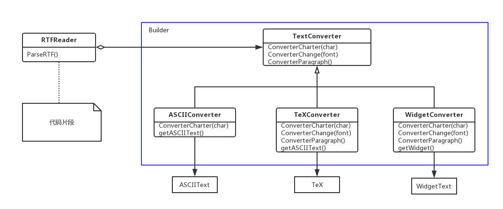
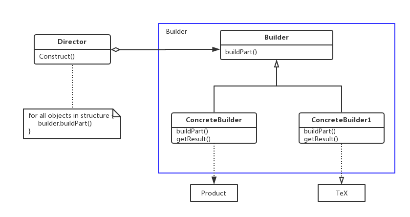

### Builder

生成器——对象创建型模式。

#### 1、意图

将一个复杂对象的构建与它的表示分离，使得同样的构建过程可以创建不同的表示。

#### 2、动机

一个RTF文档交换格式的阅读器应能够将RTF转换为多种正文格式。该阅读器可以将RTF文档转换成普通ASCII文本或转换成一个能以交互方式编辑的正文窗口组件。但问题在于可能转换的数目是无限的。因此要能够很容易实现新的转换的增加，同时却不改变RTF阅读器。

一个解决办法是用一个可以将RTF转换成另一种正文表示的TextConverter对象配置这个RTFReader类。当RTFReader对RTF文档进行语法分析时，它使用TextConverter去做转换，无论何时RTFReader识别了一个RTF标记，它都发送一个请求给TextConverter去转换这个标记。TextConverter对象负责进行数据转换以及用特定格式表示该标记，如下图所示：

TextConverter的子类对不同转换和不同格式进行特殊处理，如一个ASCIIConverter只负责转换普通文本，而忽略其他转换请求，一个TextConverter将会为实现对所有请求的操作，以便生成一个获取正文中所有风格信息的TEX表示，一个WidgetConverter将生成一个复杂的用户界面以便用户浏览和编辑正文。

每种转换器类将创建和装配一个复杂对象的机制隐含在抽象接口的后面。转换器独立于阅读器，阅读器负责对一个RTF文档进行语法分析。

Builder模式描述了所有这些关系。每一个转换器类在该模式中被称为生成器（Builder），而阅读器则称为导向器（Director）。上面的例子中，Builder模式将分析文本格式的算法与描述怎么创建和表示一个转换后格式的算法分离开来，这使得我们可以重用RTFReader的语法分析算法，根据RTF文档创建不同的正文表示——仅需要用不同的TextConverter的子类配置该RTFReader即可。

#### 3、适用性

在以下情况使用Builder模式：

- 当创建复杂对象的算法应该独立于该对象的组成部分以及它们的装配方式时；
- 当构造过程必须允许被构造的对象有不同的表示时。

#### 4、结构图

#### 5、参与者

- Builder（TextConverter）：为创建一个Product对象的各个部件指定抽象接口；
- ConcreteBuilder（ASCIIConvert）：
  - 实现Builder的接口以构造和装配该产品的各个部件；
  - 定义并明确它所创建的表示；
  - 提供一个检索产品的接口（如getResult）。
- Director（RTFReader）：构造一个使用Builder接口的对象；
- Product（ASCIIText）：
  - 表示被构造的复杂对象，ConcreteBuilder创建该产品的内部表示并定义它的装配过程；
  - 包含定义组成部件的类，包括将这些部件装配成最终产品的接口。

#### 6、协作

- 客户创建Director对象，并用它所想要的Builder对象进行配置；
- 一旦产品部件被生成，Director就会通知Builder；
- 客户从Builder中检索产品。

#### 7、效果

- 可以改变一个产品的内部表示：Builder对象提供给Director一个构造产品的抽象接口。该接口使得生成器可以隐藏这个产品的表示和内部结构，同时也隐藏了该产品是如何装配的，因为产品是通过抽象接口构造的。在想要改变产品的内部表示时，所要做的就是定义一个新的生成器；
- 将构造代码和表示代码分开：Builder模式通过封装一个复杂对象的创建和表示方式提高了对象的模块性。客户不需要知道定义产品内部结构的类的所有信息：这些类是不出现在Builder接口中的。每个ConcreteBuilder包含了创建和装配一个特定产品的所有代码，然后不同的Director可以复用它以在相同部件集合的基础上构建不同的Product；
- 可对构造过程进行更精细的控制：Builder模式与一下子就生成产品的创建型模式不同，它是在导向者的控制下一步一步构造产品的，仅当该产品完成时导向者才会从生成器取回它。因此Builder接口相比其他创建型模式能更好地反映产品的构造过程，使得我们可以更精细的控制构建过程，从而能更精细的控制所得产品的内部结构。

#### 8、实现

通常有一个抽象的Builder类为导向者可能要求创建的每一个构件定义一个操作。这些操作缺省情况下什么都不做，一个ConcreteBuilder类对它有兴趣创建的构件重定义这些操作。

以下是需要考虑的现实问题：

- 装配和构造接口：生成器逐步的构造它们的产品，因此Builder类接口必须足够普遍，以便为各种类型的具体生成器构造产品。一个关键的设计问题在于构造和装配过程的模型，构造请求的结果只是被添加到产品中，有时需要访问前面已经构造了的产品部件，这种情况下，生成器会将子节点返回给导向者，然后导向者将它们回传给生成者去创建父节点；
- 为什么产品没有抽象类：通常情况下，由具体生成器生成的产品，它们的表示相差是如此之大以至于给不同的产品以公共父类没有太大意思。客户通常会用合适的具体生成器来配置导向者，客户处于的位置使他知道Builder的哪一个具体子类被使用和能相应处理它的产品。
- 在Builder中缺省的方法为空：将它们定义为空方法，使得客户只重定义他们所感兴趣的操作。

