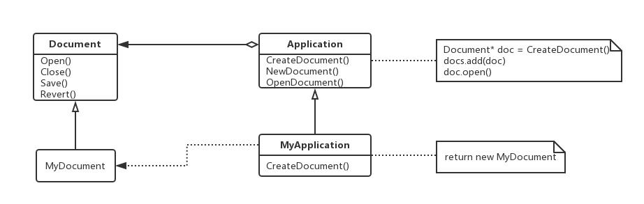
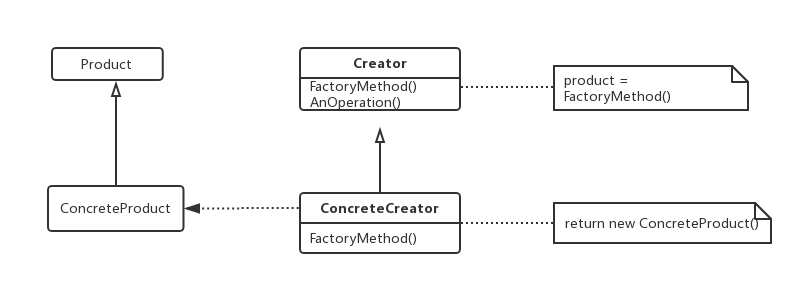
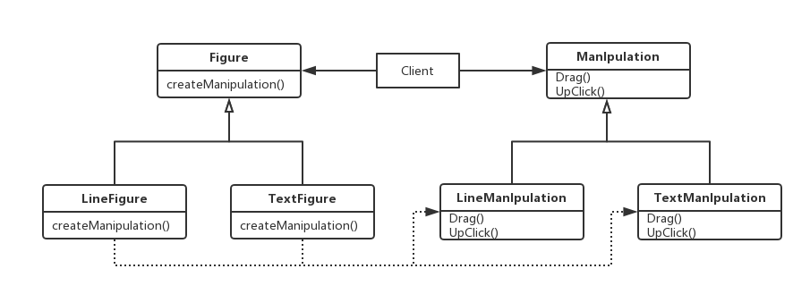

### Factory Method

工厂方法——对象创建型模式。

#### 1、意图

定义一个用于创建对象的接口，让子类决定实例化哪一个类。Factory Method使一个类的实例化延迟到其子类。

#### 2、动机

框架使用抽象类定义和维护对象之间的关系。这些对象的创建通常也由框架负责。

考虑这样一个应用框架，它可以向用户显示多个文档。在这个框架中，两个主要的抽象是类Application和Document。这两个类都是抽象的，客户必须通过它们的子类来做与具体应用相关的实现。例如，为创建一个绘图应用，我们定义类DrawingApplication和DrawingDocument。Application类负责管理Document并根据需要创建它们，如当用户从菜单中选择Open或New的时候。

因为被实例化的特定Document子类是与特定应用相关的，所以Application类不可能预测到哪个Document子类将被实例化——Application类仅知道一个新的文档何时应该被创建，而不知道哪一种Document将被创建。这里就有一个问题：框架必须实例化类，但是它只知道不能被实例化的抽象类。

Factory Method模式提供了一个解决方案：它封装了哪一个Document子类将被创建的信息，并将这些信息从该框架中分类出来，如下图所示：

Application的子类重定义Application的抽象操作CreateDocument以返回适当的Document子类对象。一旦一个Application子类实例化以后，它就可以实例化与应用相关的文档，而无需知道这些文档的类。我们称CreateDocument是一个工厂方法，因为它负责生产一个对象。

#### 3、适用性

在以下情况可以使用Factory Method模式：

- 当一个类不知道它所必须创建的对象的类的时候；
- 当一个类希望由它的子类来指定它所创建的对象的时候；
- 当类将创建对象的职责委托给多个帮助子类中的某一个，并且你希望将哪一个帮助子类是代理者这一信息局部化的时候。

#### 4、结构图

#### 5、参与者

- Product（Document）：定义工厂方法所创建的对象的接口；
- ConcreteProduct（MyDocument）：实现Product接口；
- Creator（Application）：
  - 声明工厂方法，该方法返回一个Product类型的对象；Creator也可以定义一个工厂方法的缺省实现，它返回一个缺省的ConcreteProduct对象；
  - 可以调用工厂方法以创建一个Product对象。
- ConcreteCreator（MyApplication）：重定义工厂方法以返回一个ConcreteProduct实例。

#### 6、协作

Creator依赖于它的子类来定义工厂方法，所以它返回一个适当的ConcreteProduct实例。

#### 7、效果

工厂方法不再将与特定应用有关的类绑定到你的代码中。代码仅处理Product接口，因此它可以与用户定义的任何ConcreteProduct类一起使用。

工厂方法的一个潜在的缺点在于客户可能仅仅为了创建一个特定的ConcreteProduct对象，就不得不创建Creator的子类。当Creator子类不必需时，客户现在必然要处理类演化的其他方面；但是当客户无论如何必须创建Creator的子类时，创建子类也是可行的。

以下是Factory Method模式的另外两种效果：

- 为子类提供Hook：用工厂方法在一个类的内部创建对象通常比直接创建对象更灵活，Factory Method给子类一个挂钩以提供对象的扩展版本；

- 连接平行的类层次：工厂方法并不往往只是被Creator调用，客户可以找到一些有用的工厂方法，尤其在平行类层次的情况下。

  - 当一个类将它的一些职责委托给一个独立的类的时候，就产生了平行类层次。考虑可以被交互操纵的图形，也就是说，它们可以用鼠标进行伸展、移动或旋转。实现这一的交互并不总是很容易，它通常需要存储和更新在给定时刻记录操纵状态的信息，这个状态仅仅在操作时需要。因此它不需要被保存在图形对象中，此外，当用户操作图形时，不同的图形有不同的行为，如将直线图形拉长可能会产生一个端点被移动的效果，而伸展正文图形则可能会改变行距。

  - 有了这些限制，最好使用一个独立的Manipulation对象实现交互并保存所需要的任何与特定操纵相关的状态。不同的图形将使用不同的Manipulation子类来处理特定的交互。得到的Manipulation类层次与Figure类层次是平行的，如下图：

    

  Figure类提供了一个CreateManipulation工厂方法，它使得客户可以创建一个与Figure相对应的Manipulation。Figure子类重定义该方法以返回一个合适的Manipulation子类实例。作为一种选择，Figure类可以实现CreateManipulation以返回一个默认的Manipulation实例，而Figure类可以只继承这个缺省实现。这样的Figure类不需要相应的Manipulation子类——因此该层次只是部分平行的。

  #### 8、实现

  当应用Factory Method模式时要考虑以下问题：

  - 主要有2中不同的情况：
    - Creator类是一个抽象类并且不提供它所声明的工厂方法的实现；
    - Creator是一个具体的类而且为工厂方法提供一个缺省的实现。
    - 第一种情况需要子类来定义实现，因为没有合理的缺省实现，它避免了不得不实例化不可预见的类的问题；第二种情况中，具体的Creator主要因为灵活性才使用工厂方法，它所遵循的准则是：用一个独立的操作创建对象，这样子类才能重定义它们的创建模式。这条准则保证了子类的设计者能够在必要的时候改变父类所实例化的对象的类。
  - 参数化工厂方法：该模式的另一种情况使得工厂方法可以创建多种产品。工厂方法采用一个标识要被创建的对象种类的参数。工厂方法创建的所有对象将共享Product接口。重定义一个参数化工厂方法使你可以简单而有选择性的扩展或改变一个Creator生产的产品，你可以为新产品引入新的标识符，或可以将已有的标识符与不同的产品相关联。
  - 特定语言的变化和问题：不同的语言有助于产生其他一些有趣的变化和警告。
  - 使用模板以避免创建子类：工厂方法另一个潜在的问题是可能仅为了创建适当的Product对象而迫使你创建Creator子类，在C++中一个解决方案是提供Creator的一个模板子类，它使得Product类作为模板参数。
  - 命名约定：可以清楚说明正在使用的工厂方法。
