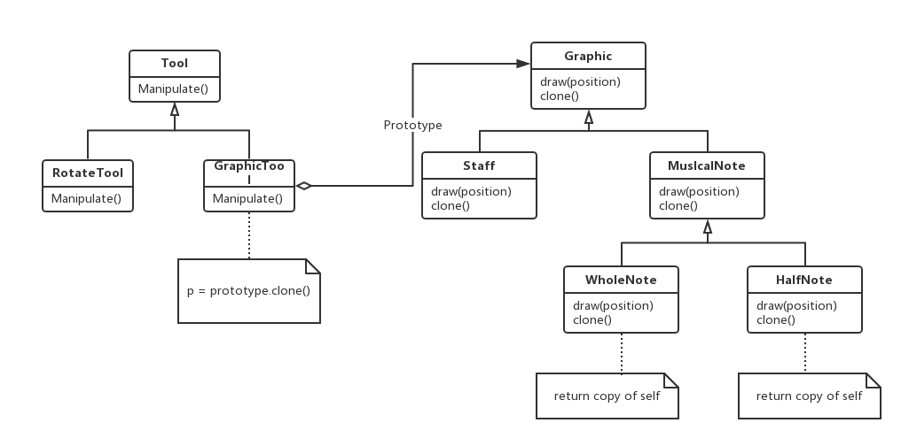
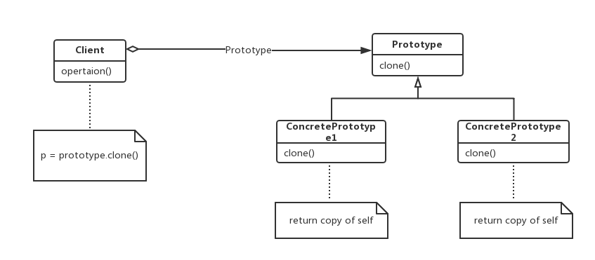

### Prototype

原型——对象创建型模式。

#### 1、意图

用原型实例指定创建对象的种类，并且通过拷贝这些原型创建新的对象。

#### 2、动机

可以通过定制一个通用的图形编辑器框架和增加一些表示音符、休止符和五线谱的新对象来构造一个乐谱编辑器。这个编辑器框架可能有一个工具选择板用于将这些音乐对象加到乐谱中。这个选择板可能还包括选择、移动和其他操纵音乐对象的工具。用户可以点击四分音符工具并使用它将四分音符加到乐谱中。或他们可以使用移动工具在五线谱上上下移动一个音符，从而改变它的音调。

我们假定框架为音符和五线谱的图形构件提供了一个抽象的Graphics类。此外，为定义选择板中的工具，还提供一个抽象类Tool。该框架为一个创建图形对象实例并将它们加入到文档中的工具预定义了一个GraphicTool子类。

但GraphicTool给框架设计者带来了一个问题。音符和五线谱的类特定于我们的应用，而GraphicTool类却属于框架。GraphicTool不知道如何创建我们的音乐类的实例，并将它们添加到乐谱中。我们可以为每一种音乐对象创建一个GraphicTool的子类，但这样会产生大量的子类，这些子类仅仅在它们所初始化的音乐对象的类别上有所不同。我们知道对象组合是比创建子类更灵活的一种选择，问题是，该框架怎么样用它来参数化GraphicTool的实例，而这些实例是由Graphic类所支持创建的。

解决办法是让GraphicTool通过拷贝或者克隆一个Graphic子类的实例来创建新的Graphic，我们称这个实例为一个原型。GraphicTool将它应该克隆和添加到文档中的原型作为参数。如果所有Graphic子类都支持一个clone操作，那么GraphicTool可以克隆所有种类的Graphic，如下图所示：

因此在我们的音乐编辑器中，用于创建音乐对象的每一种工具都是一个用不同原型进行初始化的GraphicTool实例，通过克隆一个音乐对象的原型并将这个克隆添加到乐谱中，每个GraphicTool实例都会产生一个音乐对象。

我们甚至可以进一步使用Prototype模式来减少类的数目。

#### 3、适用性

当一个系统应该独立于它的产品创建、构成和表示时，要使用Prototype模式，以及：

- 当要实例化的类是在运行时刻指定时，如通过动态装载；
- 为了避免创建一个与产品类层次平行的工厂类层次时；
- 当一个类的实例只能有几个不同状态组合中的一种时：建立相应数目的原型并克隆它们可能比每次用合适的状态手工实例化该类更方便一些。

#### 4、结构图

#### 5、参与者

- Prototype（Graphic）：声明一个克隆自身的接口；
- ConcretePrototype（WholeNote）：实现一个克隆自身的操作；
- Client（GraphicTool）：让一个原型克隆自身从而创建一个新的对象。

#### 6、协作

客户请求一个原型克隆自身。

#### 7、效果

Prototype有许多和AbstractFactory和Builder一样的效果：它对客户隐藏了了具体的产品类，因此减少了客户知道的名字和数目，另外，这种模式使用客户无需改变即可使用与特定应用相关的类。

Prototype模式的优点：

- 运行时增加和删除产品：Prototype允许只通过客户注册原型实例就可以将一个新的具体产品类并入系统，它比其他创建型模式更为灵活，因为客户可以在运行时建立和删除原型；
- 改变值以指定新对象：高度动态的系统允许你通过对象组合定义新的行为，如通过为一个对象变量指定值——并且不定义新的类。通过实例化已有类并且将这些实例注册为客户对象的原型，就可以有效定义新类别的对象。客户可以将职责代理给原型，从而表现出新的行为；
- 改变结构以指定新对象：许多应用由部件和子部件来创建对象。为了方便，这样的应用通常允许你实例化复杂的、用户定义的结构，Prototype模式也支持这一点；
- 减少子类的构造：Factory Method经常产生一个与产品类层次平行的Creator类层次，Prototype模式使得你克隆一个原型而不是请求一个工厂方法去产生一个新的对象。因此根本不需要Creator层次；
- 用类动态配置应用：一些运行时刻环境允许你动态将类装载到应用中。

Prototype模式的缺点：每一个Prototype的子类都必须实现Clone操作，这可能很困难，如当所考虑的类已经存在时就难以新增clone操作，当内部包括一些不支持拷贝或有循环引用的对象时，实现克隆可能也会很困难的。

#### 8、实现

当实现原型时，要考虑以下一些问题。

##### 8.1 使用一个原型管理器

当一个系统中原型数目不固定时（它们可以动态创建或销毁），要保持一个可用原型的注册表。客户不会自己来管理原型，但会在注册表中存储和检索原型。当客户在克隆一个原型前会向注册表请求该原型，我们称这个注册表为原型管理器。

原型管理器是一个关联存储器，它返回一个与给定关键字相匹配的原型。它有一些操作可以用来通过关键字注册原型和解除注册。客户可以在运行时更改甚至浏览这个注册表，这使得客户无需编写代码就可以扩展并得到系统清单。

##### 8.2 实现克隆操作

Prototype模式最困难的部分在于正确实现clone操作，当对象结构包含循环引用时，这尤为棘手。

##### 8.3 初始化克隆对象

当一些客户对克隆对象已经相当满意时，另一些客户将会希望我使用它们所选择的的一些值来初始化该对象的一些或所有的内部状态。一般来说不可能在clone操作中传递这些值，因为这些值的数目由于原型的类不同而会有所不同。一些原型可能需要多个初始化参数，另一些可能什么都不需要。在clone操作中传递参数会破坏克隆接口的统一性。

