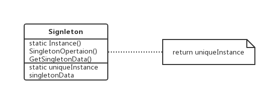

### Singleton

单例——对象创建型模式。

#### 1、意图

保证一个类仅有一个实例，并提供一个访问它的全局访问点。

#### 2、动机

对一些类来说，只有一个实例是很重要的。我们怎样才能保证一个类只有一个实例并且这个实例易于被访问呢？一个全局变量使得一个对象可以被访问，但它不能防止你实例化多个对象。

一个更好的办法是：让类自身负责保存它的唯一实例。这个类可以保证没有其他实例可以被创建，并且它可以提供一个访问该实例的方法。这就是Singleton模式。

#### 3、适用性

在下面的情况下可以使用Singleton模式：

- 当类只能有一个实例而且客户可以从一个从所周知的访问点访问它时；
- 当这个类唯一实例应该是通过子类化可扩展的，并且客户应该无需更改代码就能使用一个扩展的实例时。

#### 4、结构图



#### 5、参与者

- Singleton：
  - 定义一个Instance操作，允许客户访问它的唯一实例。Instance是一个类操作；
  - 可能负责创建它自己的唯一实例。

#### 6、协作

客户只能通过Singleton的Instance操作访问一个Singleton的实例。

#### 7、效果

Singleton模式有许多优点：

- 对唯一实例的受控访问：因为Singleton类封装了它的唯一实例，所以它可以严格的控制客户怎样以及何时访问它；
- 缩小命名空间：SIngleton模式是对全局变量的一种改进，它避免了那些存储唯一实例的全局变量污染空间；
- 允许对操作和表示的精化：Singleton类可以有子类，而且用这个扩展类的实例来配置一个应用是很容易的；可以用需要的类的实例在运行时刻配置应用；
- 允许可变数目的实例；
- 比类操作更灵活。

#### 8、效果

下面是使用Singleton模式时需要考虑的问题。

##### 8.1 保证一个唯一的实例

Singleton模式使得这个唯一的实例是类的一般实例，但该类被写成只有一个实例能被创建。做到这一点的一个常用方法是将创建这个实例的操作隐藏在一个类操作后面，由它保证只有一个实例被创建。这个操作可以访问保存唯一实例的变量，而且它可以保证这个变量在返回值之前用这个唯一实例初始化。这种方法保证了单例在它的首次使用前被创建和使用。

将单例定义为一个全局或静态的对象，然后依赖于自动的初始化，有以下三个问题：

- 不能保证静态对象只有一个实例会被声明；
- 没有足够的信息在静态初始化时实例化每一个单例，单例可能需要在程序运行中计算出来的值；
- 单例之间不存在依赖关系。

另外， 使用全局或静态对象实现的话，还有一个问题：使得所有单例无论是否用到都要被创建。

##### 8.2 创建Singleton类的子类

主要问题与其说是定义子类不如说是简历它的唯一实例，这样客户就可以使用它。事实上，指向单例的变量必须用子类的实例进行初始化。最简单的技术是在Singleton的Instance操作中决定你想使用的是哪一个单例。

另一个选择Singleton的子类的方法是将Instance的实现从父类中分离出来并将它放入子类。但这两种方式都不够灵活。

一个更灵活的方法是使用一个单例注册表，可能的Singleton类的集合不是由Instance定义的，Singleton类可以根据名字在一个从所周知的注册表中注册它们的单例实例。

这个注册表在字符串和单例之间建立映射，但Instance需要一个单例时，它参考注册表，根据名字请求单例。

注册表查询相应的单例并返回它。这个方法使得Instance不再需要知道所有可能的Singleton类或实例，它所需要知道的只是所有Singleton类的一个公共的接口，该接口包括了对注册表的操作。

```
class Singleton {
    public:
    	static void register(const char* name, Singleton*);
    	static Singleton* Instance();
    protected:
    	static Singleton* lookup(const char* name);
    private:
    	static Singleton* _instance;
    	static List<NameSingletonPair>* _registry;
}
```

